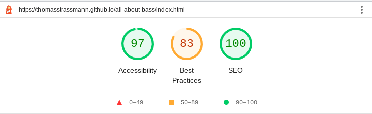

# All about bass
## Your resource for basses 

[Click here for the full website access](https://thomasstrassmann.github.io/all-about-bass/)

## Table of contents
1. [Introduction](#introduction) 
2. [Preparation - UX and UXD](#preparation)
3. [Features](#features)
4. [Testing](#testing)
5. [Deployment](#deployment) 
6. [Credits / attributes](#credits) 

## Introduction 

This website is about one of my biggest passions: playing bass. I´ve been a bass player for over 20 years now and because of that it made sense to me to do a project about it.

What should this page achieve? 
Well, on the one hand it should infect people with my enthusiasm for this instrument - people who have little or no connection to the instrument in this case. 
On the other hand, visitors who are already interested in the subject, or who are passionate bass players themselves, should find a platform that informs about the history of the development of the electric bass and create new incentives to play.

## Preparation - UX and UXD

As it may have become clear in the introduction, this site is intended for a broad audience. 
This is a webpage about bass, that is catchy to new interested people, but also filled with content, that could be relevant to a professional bass player. The challenge is to collect or create content that will appeal to any potential website visitor interested in the topic. In whatever way - as an introduction to the topic, or as a source of ideas for your own bass lines.

The **UX for newcomers** to the field should be simple and intuitive - not only in terms of navigation (which should always be intuitive), but especially in terms of content. The content should not discourage or give a complicated impression, but emphasize the ease of playing bass. Inexperienced bass players will most likely need more input than "veterans", which is why external links are a great option for this target group. 

The **UX for experienced players** should be different from that for newcomers in terms of content. 
In particular, videos or other external sources are more likely to be tailored to the skilled bass player for several reasons: Experienced bassists will find themselves getting ideas for their own compositions, or their own playing style, and thus see the site as a reliable source. This "advanced" content, however, is also exciting for newcomers: because it arouses curiosity, shows what is possible and represents a possible goal - e.g. "I would like to be able to play like that one day."  

In terms of content, there is also an intersection, which is the history of the electric bass. This can be exciting for both target groups, since there are also good bass players who know little about the history of the instrument.

The **UXD - User Experience Design** was declared and described in advance and includes the 5 panels *strategy, scope, structure, skeleton and surface*. 

### Strategy 
All content and external links are culturally appropriate, completely regardless of where a user is from. Music connects and therefore should not exclude anyone. 

What makes this website so special is a mix of relevant content for all bass players (regardless of experience level), videos that will excite any music fan, and a history of the electric bass that is easy to follow, engaging, and has a common thread.

To cataloge the content, we have different types of content available: youtube-videos, paragraphs of self-written text and links to external resources. In the creation process, care is also taken to ensure that all content is relevant - because all musicians are passionate in some way about music videos, or the history of their own instrument.

In terms of technology, one of the things that can be stated is that all technologies are appropriate and feasible for display. This includes, for example, the embedding of videos, the graphical display of a timeline and the responsiveness on all devices. 

---
### Scope 
In this section, the assumption is made that each visitor has different goals or ambitions. One may just want to explore new musicians, another may want to learn more about the instrument, and another may want to find inspiration. Knowing about these different wants and needs are important to implement the site for the target groups. 

To get there, the user must realize at first glance that there are three separate and extensive pages (index, history, influential players) that are easy to reach and only require a maximum of 1-2 clicks.

Now much has been written about what is possible. What is not feasible and therefore limits the page is the implementation of dynamic content, because in this module JavaScript is not used. The exception to the rule is the hamburger menu (a pure HTML and CSS hamburger menu is simply much more complex and time-consuming to implement). Because JavaScript is only a few lines of code, it will be implemented in a script tag below every HTML page, instead of creating an external file.

--- 
### Structure 
The website consists of 3 HTML pages to best implement the previously listed points. 

**Index page** 

A navigation bar with the 3 sections can be found in the header. An own logo will be created for the website. The navigation bar will change to a hamburger menu on smaller devices. Just below the navigation bar, there will be a large hero section with a sub-heading. Here you can see directly what the site offers and who it is for. There is also the possibility to sign up for a hypothetical playing tips newsletter via form. At the bottom, the footer will cap off all pages with links to external sources. 

**History page**

The history page will work with a vertical timeline containing the most important history facts(steps of decades). For the sake of better readability and accessibility, the text passages will be provided with a high-contrast background.

**Influential players page**   

This site will contain a selection of the best bass players throughout the history. Basically, you can think of this as the Hall of Fame of bass playing. A gallery with videos and a short paragraph describing the bass player.

*All subpages besides the index page, will of course also have the navigation bar and the footer.*

---
### Skeleton 
To get a visual idea of the already mentioned content, a blueprint or wireframe model was made. There are corresponding wireframe models for each HTML page. For the sake of completeness, it should be mentioned here that the wireframes are not binding and ideas and conceptions of the website may change during the development phase.

You can click [here](./assets/wireframes/) to take a look at the wireframes.

---
### Surface
As a result of the wireframe model, a first visual language was created in the last panel of the User Expericence Design. This can be found [here](./assets/visual-language/).
For the sake of completeness, it should be mentioned here that the design layouts are not binding and ideas and conceptions of the website may change during the development phase.
Since there were restrictions in terms of design software (pencil) and since time is short, the design approaches are rudimentary and leave room for design.

The color palette considered is composed of an orange tone of the bass from the hero image, with the application of other compound colors. Adobe's Color Wheel was used for this purpose. The colors are also located in the link above. 

Google Fonts was used for the typography. The font 'Fjallo One' is used for important texts and headlines, the font 'Inter' is used for descriptive paragraphs. For the icons in the footer, the fontawesome page was a reliable source.

A website logo was created with the Adobe Creative Cloud, Adobe Express to be exact. The website logo is also part of the [visual-language folder](./assets/visual-language/).

## Features

### Basic features 
All HTML files have certain features in common and these are: 
* A custom logo.
* Responsive content and layout using relative sizes.
* A fixed header that has a hamburger menu on narrower devices. 
* Hover and slide-in effect in the menu, the hamburger displays a "x" when active.
* Media query that takes into account the landscape mode and thus avoids incorrect rendering.
* Responsive font-size, implemented with the clamp function in CSS.

### Index page specific features
In addition to the basic features, the index page also has other special features...
* a large hero section with a brightness effect that lasts 3 seconds and then rests because the value of the fill-mode is forwards. 
* A responsive introduction section that displays the image as a block element on smaller devices. On wide devices, the text flows around the image on the right. 
* A hypothetical form element that allows users to sign up for a newsletter using the appropriate back-end technology.

### History page specific features 
In addition to the basic features, the history page has the following special features...
* A vertical timeline was created using CSS. 
* Responsive Youtube videos via iframe depict a better historical context.

### Players page specific features
In addition to the basic features, the history page has the following special features...

* A gallery with responsive iframes showcasing influential bass players.

### Features for the future 
The following features would be ideas for further development...
* Playing tips page for beginners and advanced players (resource hub of the newsletter)
* Community area with a forum and a bass encyclopedia
* search function

## Testing 

The page and its functionality was tested manually. This was done primarily using Chrome DevTools (Lighthouse), as well as the website http://www.responsinator.com/. These were especially helpful to check layout, design and structure. The most persistent bug was that the background image of the hero section and the associated filter effect was not visible on mobile devices. After many fix attempts it was clear that this was related to GitHub Pages. An absolute URL as value could finally fix the bug.

Furthermore, the W3C Validator (jigsaw) was used to ensure that all HTML pages and the CSS file are valid. Hardly any errors were found. The only notable ones were a few block elements that slipped into p-tags and the obsolete frameborder attribute of the iframes that was replaced with css and the border property. 

To test accessibility and SEO, Lighthouse was used. This showed that these values were excellent. In terms of performance, there is still room for improvement, which is particularly related to the effects and the iframes. 

No other bugs were found at the time of this release. 

## Deployment 

This page is hosted via GitHub Pages, which is easily doable via the settings. In the future this webpage could also run under a custom url. 

## Credits

During the construction of this website some sources and pages were very helpful and without it, it would have been much harder, so thanks to every source down below! 
A listing of the sources is done here by categorization: 

**Images:**
Jan Kopriva, source: https://www.pexels.com/de-de/foto/person-die-gitarre-spielt-3858086/

freestocks.org, source: https://www.pexels.com/de-de/foto/person-hande-verwischen-musik-96380/

**Videos:**
All Videos belong to the publisher, who is recognizable in the video.
I do not take credit for the creation of the videos.

**Text:** 
Wikipedia, source: https://en.wikipedia.org/wiki/Bass_guitar (input ideas for history.html)

Sorkin Type, source: https://fonts.google.com/specimen/Fjalla+One?query=fjall (Fjalla One Font)

Rasmus Andersson, source: https://fonts.google.com/specimen/Inter?query=Inter (Inter Font)

Icons by https://fontawesome.com/

**Code:** 
Miguel Nunez, source: https://www.youtube.com/watch?v=flItyHiDm7E) (implementation of the hamburger menu)

w3schools.com, source https://www.w3schools.com/howto/howto_css_bullet_color.asp  (coloring of bullet point list)

w3schools.com, source: https://www.w3schools.com/howto/howto_css_responsive_iframes.asp (responsive iframe container)

Alvaro Trigo, source: https://codepen.io/alvarotrigo/pen/BawBzjM (basic design of the vertical timeline)

Code Institute, Love Running Project (basic structure of footer markup)

